# Лабораторная работа №3

### Поднимаем Postgres

Подготовили `Dockerfile`, `docker-compose` файл, `postgres0.yml` и на его основе `postgres1.yml`.

Задеплоили и проверили, что зукипер запустился и роли распределились между нодами:

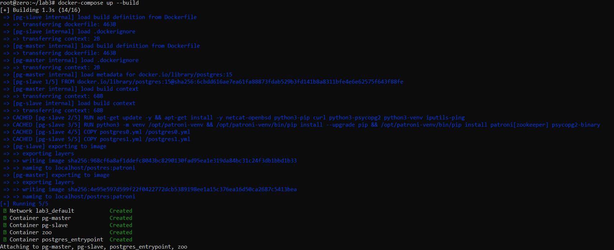

Распределение ролей (лидер - pg-master):

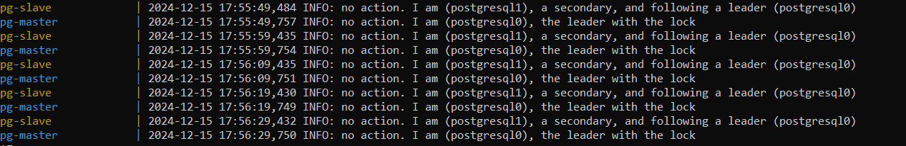

Зукипер:

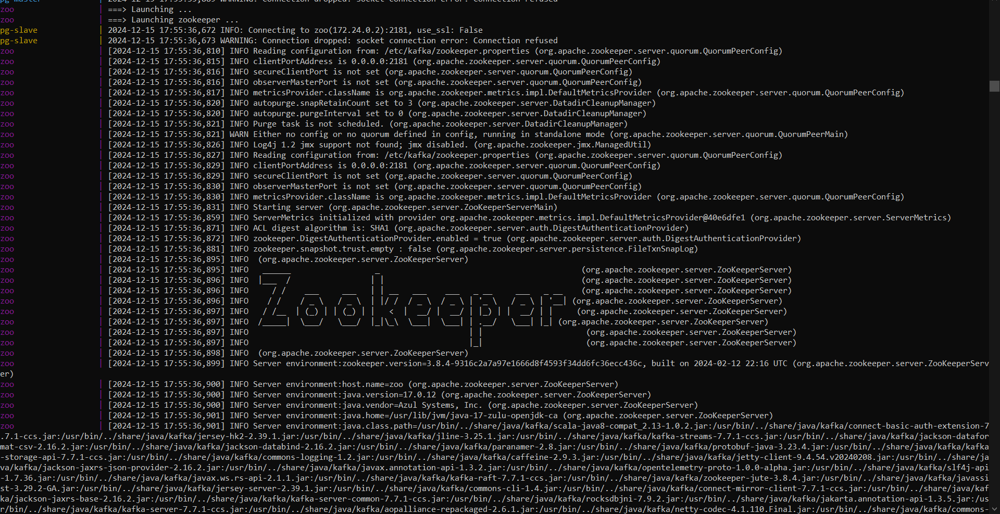

### Проверяем репликацию

Подключаемся к ноде pg-master, создаем таблицу `dogs` и добавляем в нее записи:

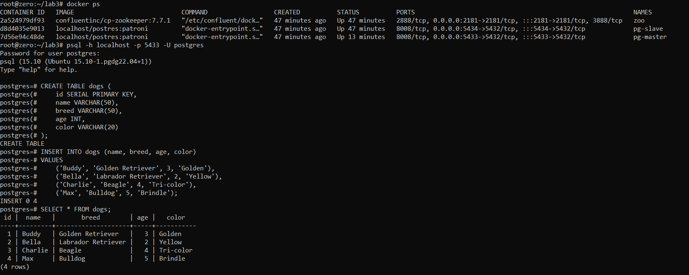

Подключаемся к ноде и проверяем, что созданная выше таблица в pg-master создалась и на pg-slave и доступна для чтения:

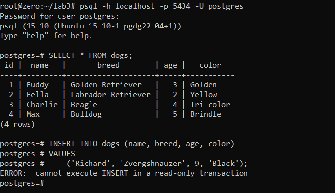

Однако при попытке внести изменения (добавить запись) получен отказ, т.к. нода работает в режиме _slave/readonly_.

### Делаем высокую доступность

В `docker-compose.yml` добавили балансировщик (HAProxy), создали `haproxy.cfg` и перезапустили проект.\

Проверили, что обе ноды корректно поднялись и распределили между собой роли (распределение осталось прежним), зукипер подцепился к кластеру без ошибок, хапрокси поднялась без ошибок:

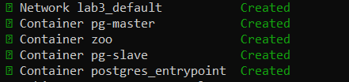

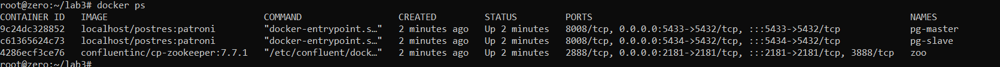

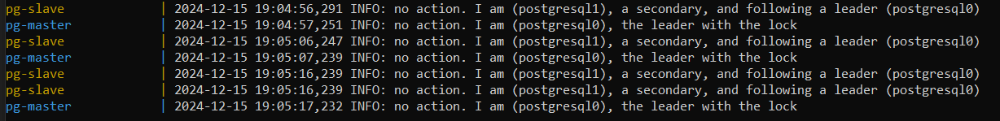

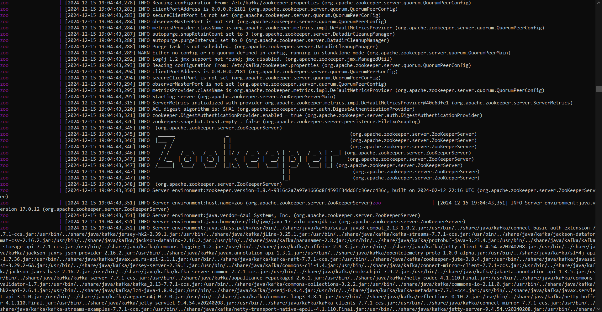

Подключаемся к postgres_entrypoint (haproxy) и проверяем, что данные из ноды pg-master доступны:

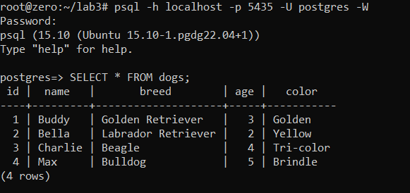

## Задание

Выключаем доступ до мастер-ноды и смотрим логи ноды pg-slave:

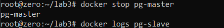

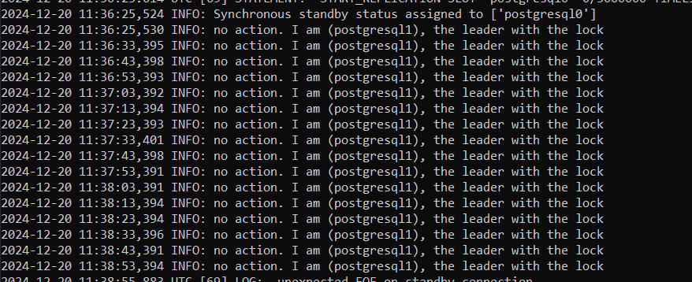

Видим, что роли изменили: pg-master больше не матсер-нода, эту роль выполняет pg-slave.

Подключаемся к ноде postgres_entrypoint и вносим изменения: добалвяем запись в таблицу. А затем подключаемся к pg-slave и видим эти же изменения:

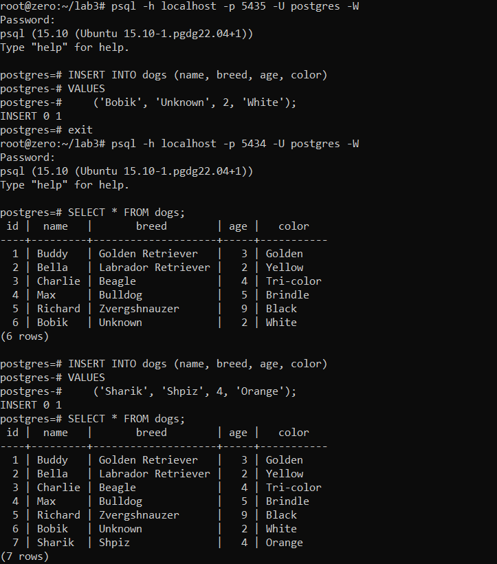

Также попробовали внести изменения в таблицу с pg-slave и видим, что режим изменился и редактирование доступно.

## Ответы на вопросы

1. Порты 8008 и 5432 вынесены в разные директивы, expose и ports. По сути, если записать 8008 в ports, то он тоже станет exposed. В чем разница?

expose используется для открытия портов внутри сети докер, если контейнеры взаимодействуют только между собой и доступ откуда-то извне не нужен

ports дает доступ к портам извне, перенаправляя их на хост-машину. При этом указание порта в ports автоматически включает функциональность expose, т.е. порт становится доступным как для контейнеров в сети докер, так и для чужих клиентов.

2. При обычном перезапуске композ-проекта, будет ли сбилден заново образ? А если предварительно отредактировать файлы postgresX.yml? А если содержимое самого Dockerfile? Почему?

Образ не пересоберется, так как используются уже существующие образы из локального кэша. 

Если изменить postgresX.yml, то это повлияет только на конфигурацию контейнеров и пересборки образа тоже не будет.

Если изменить Dockerfile, то образ не пересоберется автоматически при перезапуске, тк compose не отслеживает изменения в этом файле, а использует уже созданные образы. Для пересборки образа после изменения dockerfile можно использлвать флаг --build.

